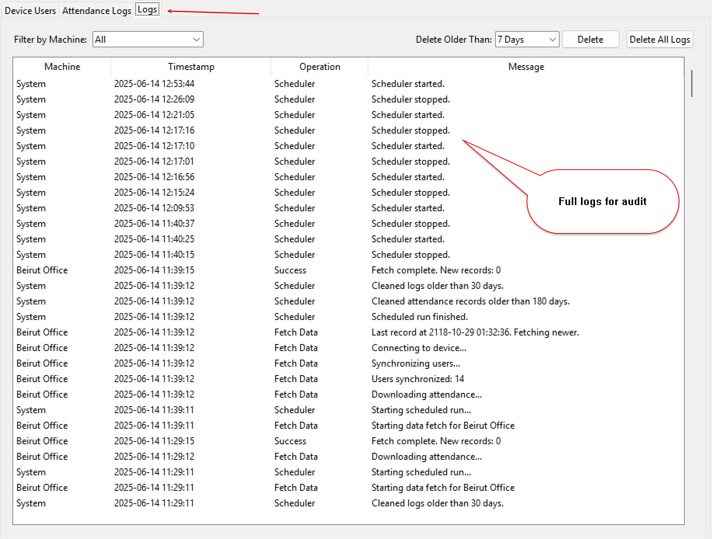
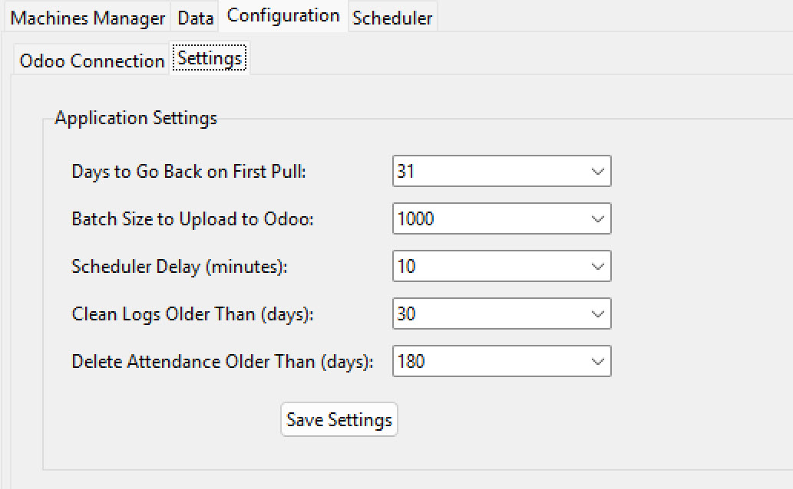
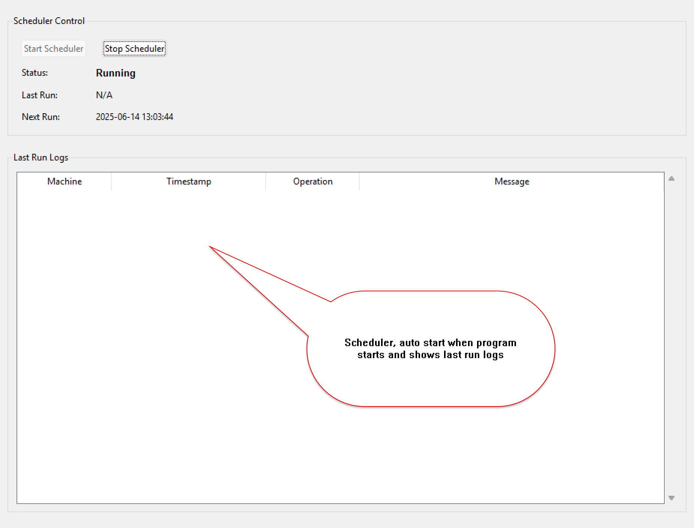

# Azkatech's ZKTeco Machine Proxy


## Overview

Welcome to Azkatech's official proxy tool for ZKTeco attendance machines. This powerful, lightweight application acts as a bridge between your physical ZKTeco devices and your Odoo database. It seamlessly connects to machines on your local network, pulls attendance data automatically, and then uploads it directly into your Odoo instance (cloud or on-premise), providing a complete [Odoo Attendance Integration](https://azka.tech).

This tool is designed to be a set-and-forget solution. With its built-in scheduler, it runs in the background to keep your attendance records consistently up-to-date, forming a critical component of your [HR Attendance](https://azka.tech) and [HR Payroll](https://azka.tech) systems.

---

## Features

### Machines Manager
This screen is the main hub for managing your ZKTeco devices. You can add, edit, and view all connected machines. It allows you to configure connection details like IP address and port, and also link them to their corresponding records in Odoo by name to retrieve an Odoo-specific ID. From here, you can test connections, fetch data manually, and sync with Odoo.


### Device Users
The Device Users tab provides a comprehensive list of all user profiles downloaded from all your ZKTeco machines. It clearly displays which machine each user belongs to, along with their name and device-specific IDs. You can filter this list to show only users who haven't yet been synchronized to Odoo.


### Attendance Logs
This tab shows a detailed log of every attendance record pulled from the devices. You can see the user ID, the exact timestamp of the punch, and critically, the time the record was successfully synchronized to Odoo. This provides a clear audit trail for your records.


### Operation Logs
The Logs tab offers a complete, timestamped audit trail of every operation the application performs, from starting the scheduler to fetching data and reporting errors. You can filter the logs by a specific machine and clear old entries to keep the history manageable.


### Odoo Connection
This screen is where you configure the connection to your Odoo database. You provide the URL, database name, username, and a password (or API key). The "Test Connection" button verifies these details and confirms that the proxy can communicate with your Odoo instance.


### Settings
The Settings tab allows you to customize the application's behavior. You can define how far back to look for records on the first data pull, set the batch size for Odoo uploads to manage server load, and configure the frequency of the automatic scheduler and data cleanup jobs.


### Scheduler
This tab gives you full control over the automation process. You can start or stop the background scheduler, and at a glance, see its current status (Running/Stopped), when the last automated run occurred, and when the next one is scheduled. It also displays the logs from the most recent run for quick diagnostics.


---

## Prerequisites

To enable the synchronization between this tool and your Odoo database, you must first install the **"All in one Attendance machine/ZKTeco"** module from the official Odoo App Store.

* **Module Name**: `azk_zkteco_machine_proxy`
* **Odoo Apps Link**: [https://apps.odoo.com/apps/modules/18.0/azk_zkteco_attendance/](https://apps.odoo.com/apps/modules/18.0/azk_zkteco_attendance/)

This module provides the necessary models and API endpoints in Odoo for the proxy tool to communicate with.

---

## Installation and Usage

You can run the application in three ways: using the pre-built Windows executable, running the Python script directly, or by creating your own executable.

### 1. Running on Windows (Recommended)

Simply download and run the provided executable file: `azkteco_machine_proxy.exe`.

No installation is required. The application will launch, and you can begin configuring your machines.

#### Running on Startup

To ensure the proxy is always running when your computer is on, you can add it to the Windows Startup folder:

1.  Press `Win + R` to open the Run dialog.
2.  Type `shell:startup` and press Enter. This will open the Startup folder.
3.  Create a shortcut to `azkteco_machine_proxy.exe` inside this folder.

The application will now launch automatically every time you log in to Windows.

### 2. Running from Source

If you prefer to run the application from its Python source code, follow these steps:

1.  **Install Python**: Ensure you have Python 3.8 or newer installed on your system.
2.  **Install Requirements**: Open a terminal or command prompt in the application's directory and run the following command to install the necessary libraries from the `requirements.txt` file:
    ```bash
    pip install -r requirements.txt
    ```
3.  **Run the Application**: Once the requirements are installed, you can start the application by running:
    ```bash
    python azkteco_machine_proxy.py
    ```

### 3. Creating a Windows Executable (Optional)

You can create your own executable from the source code using `PyInstaller`.

1.  **Install PyInstaller**: If you don't have it, install it via pip:
    ```bash
    pip install pyinstaller
    ```
2.  **Build the Executable**: Navigate to the application's directory in your terminal and run the following command. The `-w` flag prevents the console window from opening when you run the application.
    ```bash
    pyinstaller --onefile -w azkteco_machine_proxy.py
    ```
3.  Your new `azkteco_machine_proxy.exe` will be located in the `dist` folder that PyInstaller creates.

---

### A Note on Generation

This program was generated using vibe coding with Gemini. The prompt used to generate the final version of this application can be found in the file: [gemini_prompt.txt](gemini_prompt.txt).

---

*Copyright © 2025 Azkatech. All rights reserved.*
